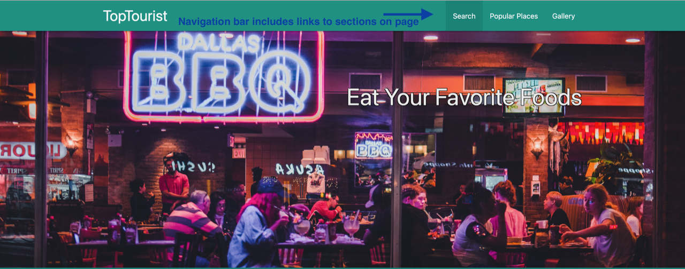
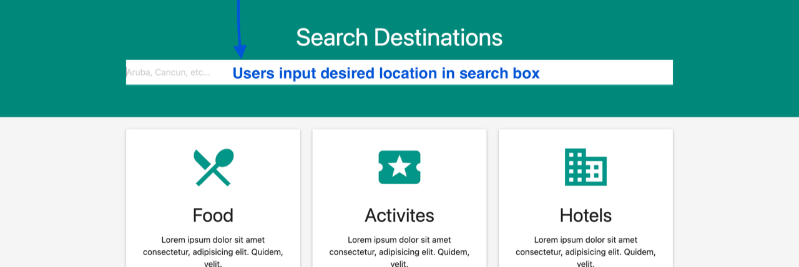
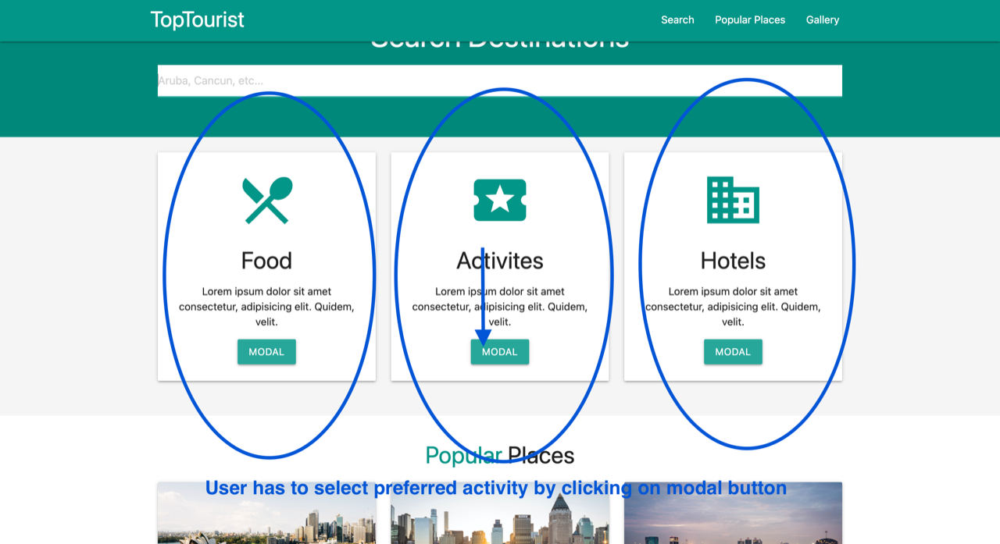
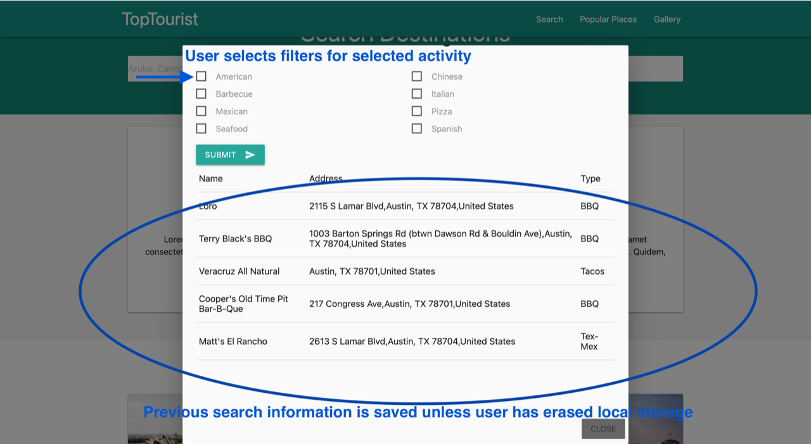
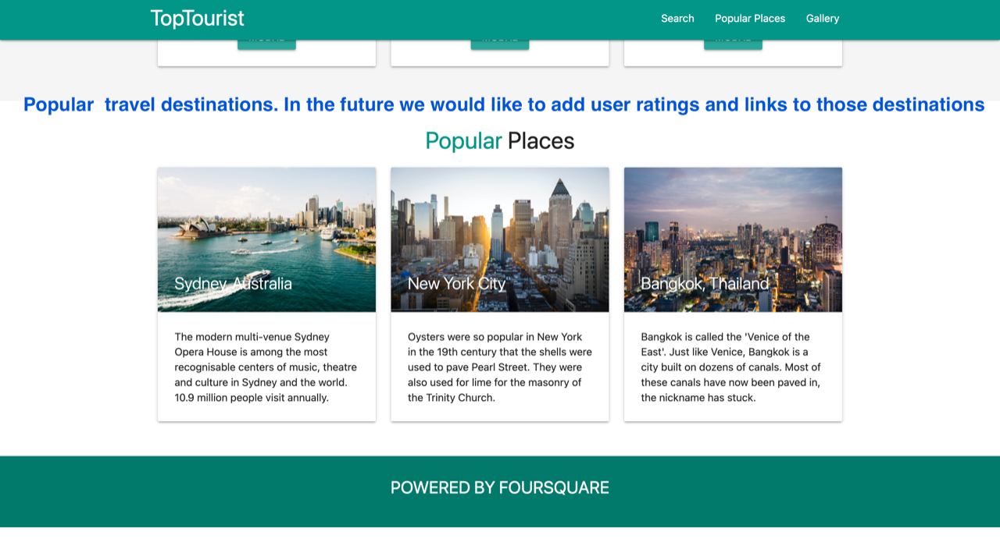
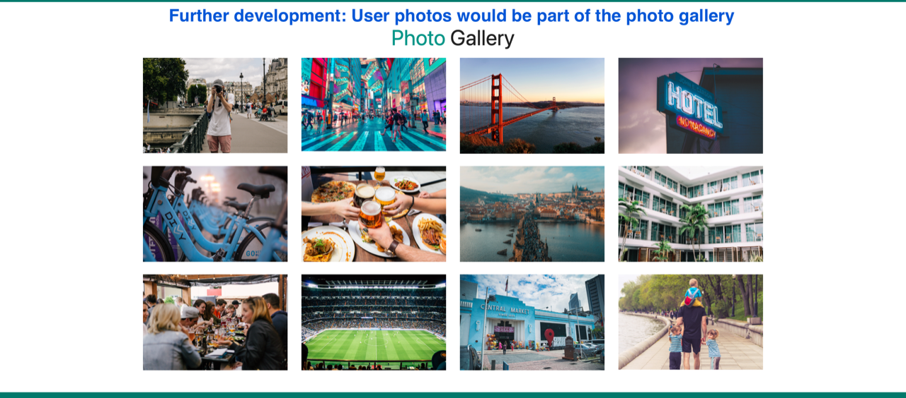

# TopTourist

# Deployed Link :

https://jguiro09.github.io/TopTourist/

# Motivation
Work in a team setting to create a client side website application using two APIs to showcase our understanding of skillsets learned at the four week mark of school.

# Objective
Create a travel web application that allows users to access business information by using server side APIS.

# Visuals & Features

## **1. Image slider that covers the three basic resources available to user.**

## **2. Navigation bar includes links for user to go directly to a specific section of the page.**

## **3. User is required to input location before deciding which "activity" they want information for.**

## **4. User must select which activity they would like to access more search information.**

## **5. Once user selects activity, activity filter modal opens where the user can customize their selections.**
## **6. Once selections are made a list will come up in modal based on selected filters.**

## **7. User can browse popular places section and read information based on location.**  
        **Future development: add links to popular places based on user ratings.**

## **8. Users are able to browse vacation photos.**

# Resources & Technology Used

HTML  
CSS  
JavaScript  
Materialize CSS  
Foursquare Place API- Postman  
Hotels API- Rapid API  
Codepen  
Unsplash  

# Contributors
Jacob Guiro  
David Gauthier  
Jonathan Foster  
Celia Pennington  

# Future Development
Add ratings and location shoutouts based on user ratings  
Allow user reviews and image uploads based on location  
